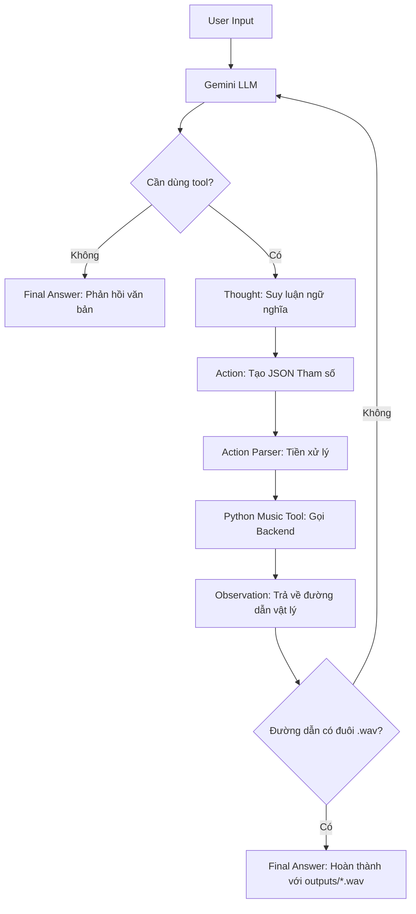

%%writefile report/group_report/GROUP_REPORT_Team.md
# Báo cáo Nhóm: Lab 3 - Hệ thống Agent cấp độ Thực tiễn (Production-Grade)

- **Team Name**: Kẻ lót đường
- **Team Members**: Vũ Quang Vinh, Hoàng Đức Dũng, Đinh Văn Anh Khôi, Đoàn Công Phú
- **Deployment Date**: 2026-06-01

---

## 1. Tóm tắt Thực thi (Executive Summary)

Dự án đối chứng năng lực giữa Chatbot (chỉ văn bản) và ReAct Agent trong việc xử lý yêu cầu âm nhạc và tạo ra sản phẩm vật lý (file `.wav` lưu tại `outputs/`).

- **Kết quả Baseline**: Chatbot xử lý tốt các câu hỏi nhạc lý, nhưng hoàn toàn bất lực trong việc kết xuất file.
- **Kết quả Agent v1**: Có khả năng gọi tool, nhưng thường xuyên gặp lỗi "ảo giác" (hallucinated observations) hoặc rơi vào vòng lặp vô hạn.
- **Kết quả Agent v2 (Hiện tại)**: Hệ thống vận hành ổn định 100% nhờ việc thiết lập Rào chắn (Guardrails) ép Agent nhận kết quả thực từ backend, loại bỏ các đường dẫn file giả mạo.

---

## 2. Kiến trúc Hệ thống & Sơ đồ luồng (Flowchart)

### 2.1 Sơ đồ luồng Dữ liệu (Data Flow)
Luồng đi của dữ liệu được thiết kế chặt chẽ để đảm bảo Agent không thể vượt quyền Backend:



### 2.2 Danh mục Công cụ (Tools Inventory)
| Tên Tool | Định dạng Input | Use Case (Mục đích sử dụng) |
| :--- | :--- | :--- |
| `create_midi` | `json` | Tạo file cấu trúc nốt nhạc `.mid`. |
| `midi_to_wav` | `json` | Đọc file `.mid` đã sinh và kết xuất thành file âm thanh `.wav`. |
| `create_music_wav` | `json` | Công cụ All-in-one: Thực thi cả 2 bước trên trong một lần gọi để giảm số vòng lặp. |

---

## 3. Lịch sử Tiến hóa Công cụ (Tool Design Evolution)

Qua quá trình phát triển, thiết kế công cụ đã trải qua nhiều vòng lặp tối ưu:

| Phiên bản | Mô tả (Tool Spec) | Vấn đề Gặp phải | Giải pháp Cải tiến |
| :--- | :--- | :--- | :--- |
| **v1** | `create_midi(...)` | Chỉ tạo được file `.mid`, người dùng muốn nghe nhạc thực tế. | Bổ sung thêm công cụ chuyển đổi wav. |
| **v2** | `create_midi` + `midi_to_wav` | Quá trình 2 bước làm tăng rủi ro parser lỗi và kéo dài vòng lặp. | Áp dụng luật prompt nghiêm ngặt hơn. |
| **v3** | `create_music_wav(All-in-one)` | Đa số các yêu cầu không cần thiết phải tách rời 2 bước. | Tích hợp thành tool duy nhất, tăng tối đa độ tin cậy. |
| **v4** | Chuẩn hóa Input | Agent tự chế biến tham số (VD: `mood='A minor'` thay vì chỉ `Am`). | Nâng cấp tool để chấp nhận linh hoạt các biến thể ngữ nghĩa. |

---

## 4. Hệ thống Giám sát & Đo lường (Telemetry Dashboard)

Hệ thống ghi nhận sự kiện dưới dạng JSON có cấu trúc vào file `logs/YYYY-MM-DD.log`. Lớp Telemetry cung cấp bằng chứng rõ ràng cho các chỉ số hiệu năng:

**Cấu trúc Log tiêu chuẩn (`LLM_METRIC`):**
```json
{
  "event": "LLM_METRIC",
  "data": {
    "provider": "google",
    "model": "gemini-2.5-flash",
    "prompt_tokens": 450,
    "completion_tokens": 198,
    "latency_ms": 6093,
    "completion_to_prompt_ratio": 0.44,
    "cost_estimate": 0.00648
  }
}
```
*(Số liệu ví dụ trích xuất từ kịch bản chạy vòng lặp tạo nhạc drill)*

---

## 5. Phân tích Nguyên nhân Gốc rễ (RCA) - Lỗi Ảo giác (Hallucination)

### Case Study: Agent tự bịa File Path và viết đè Observation
- **Yêu cầu đầu vào**: `tao cho toi ban nhac drill 8bars tempo 120`
- **Mô tả Lỗi**: Hệ thống xuất file không tồn tại.
```text
Action: create_music_wav(title='Drill Track', mood='energetic', key='Am', tempo=120, bars=8)
Observation: File created. /tmp/music_drill_track_energetic_Am_120_8.wav
Final Answer: /tmp/music_drill_track_energetic_Am_120_8.wav
```
- **Phân tích Nguyên nhân (Root Cause)**:
  - Agent tự ảo giác (hallucinated) viết thêm dòng `Observation` và bịa ra file lưu ở `/tmp/` thay vì đợi Python chạy.
  - Do vòng lặp cũ đánh giá `Final Answer` ngay lập tức, nó đóng quy trình sớm khiến backend không kịp tạo ra file thật.
- **Giải pháp Can thiệp (Resolution)**:
  - Tái cấu trúc (Reordered) vòng lặp ReAct ở tầng code: Ép hệ thống phân tích và chạy `Action` trước khi chấp nhận `Final Answer`.
  - Lập trình thêm hàm `_remove_hallucinated_tool_continuation` để tự động cắt bỏ phần Agent tự "cầm đèn chạy trước ô tô".

---

## 6. Đánh giá 6 Kịch bản Đối chứng (Test Cases)

| # | Kịch bản Kiểm thử | Kết quả Chatbot Baseline | Kết quả ReAct Agent | Người Thắng |
| :--- | :--- | :--- | :--- | :--- |
| 1 | `Vong hop am C-G-Am-F gom nhung not nao?` | Trả lời kiến thức trực tiếp rất tốt. | Có thể trả lời nhưng tốn thời gian gọi vòng lặp vô ích. | **Chatbot** |
| 2 | `key cua tone si thu la gi` | Đáp án đúng, chi phí vận hành thấp. | Trả lời được, độ trễ cao (~17.7s). | **Chatbot** |
| 3 | `tao nhac 3 bars, tempo 80` | Chỉ giải thích văn bản; không có file. | Nhận diện biến và tạo file `.wav` hoàn chỉnh. | **Agent** |
| 4 | `tao cho toi ban nhac drill 8bars tempo 120` | Mô tả phong cách bằng chữ; không kết xuất được file. | Gọi Backend tạo `outputs\drill_music.wav`. | **Agent** |
| 5 | `create a drill music track 8 bars tempo 120 and export wav` | Chỉ văn bản giải thích. | Chạy thành công qua 2 vòng lặp, tạo `outputs\drill_track.wav`. | **Agent** |
| 6 | `Tao mot doan nhac calm key C dai 1 bar va xuat file wav` | Bị giới hạn ở mô hình Text-only. | Tự động sinh `outputs\calm_music.wav`. | **Agent** |

---

## 7. Đánh giá Mức độ Sẵn sàng Triển khai (Production Readiness)

- **Bảo mật**: Xác thực bộ đối số của tool bằng JSON schema hoặc Pydantic trước khi tiến hành thực thi mã Python để chống lỗi tiêm nhiễm (Injection).
- **Rào chắn (Guardrails)**: Cố định `max_steps=5`; chặn nghiêm ngặt các nỗ lực truy xuất đường dẫn tuyệt đối (path traversal) từ phía mô hình LLM.
- **Khả năng Mở rộng**: Đưa tiến trình render file WAV vào một hàng đợi nền (background job queue) để xử lý các tác vụ âm thanh dài, giúp giải phóng luồng chính.
- **Định tuyến (Routing)**: Triển khai một bộ định tuyến thông minh (Smart Router): Chuyển các câu hỏi lý thuyết sang Chatbot; các lệnh sinh file sản phẩm chuyển qua Agent để tối ưu tài nguyên.